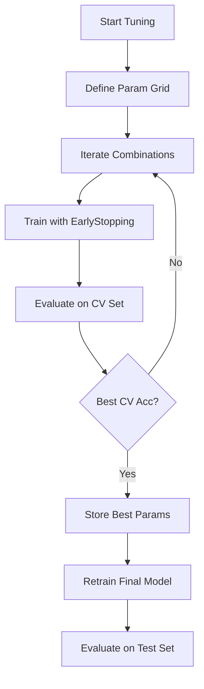

# Neural Network Optimization: Hyperparameter Tuning Report

This report provides a detailed overview of the systematic approach used to optimize the Neural Network model for the Dry Bean classification task.

## 1. Hyperparameter Tuning Strategy

To find the optimal configuration, we implemented a **Grid Search** that explores various combinations of architecture, optimization, and regularization parameters.

### Architecture (Layers and Neurons)
We evaluated different model depths and widths to balance capacity and generalization:
- **Small `[64, 32]`**: Minimal complexity, less prone to overfitting.
- **Medium `[128, 64]`**: Baseline architecture, offering moderate capacity for 16 features.
- **Large/Deep `[256, 128, 64]`**: High capacity, capable of capturing complex non-linear feature interactions (e.g., relationship between Convex Area and Shape Factors).

### Learning Rate (LR)
The learning rate controls the step size during weight updates:
- **`0.001` (Default)**: Standard Adam optimizer rate.
- **`0.0005`**: A smaller rate for more stable convergence if the loss oscillates.

### Regularization: L2 and Dropout
To prevent the model from "memorizing" the training data, we used:
- **L2 Regularization (`1e-4`, `1e-3`)**: Penalizes large weight values, keeping the decision boundary smooth.
- **Dropout (`0.0`, `0.1`, `0.2`)**: Randomly deactivates a percentage of neurons during training, forcing the network to learn redundant and robust representations.

---

## 2. Training Control: Early Stopping

Instead of using a fixed number of epochs, we used **Early Stopping** to prevent overfitting:
- **Monitor**: `val_loss` (Validation Loss).
- **Patience**: If validation loss doesn't improve for 10-15 epochs, training stops.
- **Restore Best Weights**: The model reverts to the version that achieved the lowest validation loss.

---

## 3. Optimization Workflow

The process follows a structured path from broad exploration to final evaluation:

---

## 4. Visualization & Diagnostics

The updated training history plots show **Loss** and **Accuracy** side-by-side. Use them to diagnose model behavior:

### How to Interpret Plots:
- **Overfitting**: Training loss keeps decreasing while validation loss starts increasing (Gap widens). *Solution: Increase Dropout or L2.*
- **Underfitting**: Both training and validation accuracy remain low and flat. *Solution: Use a larger architecture or more epochs.*
- **Unstable Convergence**: Large spikes in validation loss. *Solution: Lower the learning rate.*

---

## 5. Summary of Implementation

The following features were integrated into `notebooks/04_model2_NeuralNetwork.ipynb`:
- A flexible `create_model` function for arbitrary layer configurations.
- A nested loop search over the parameter grid.
- `tf.keras.callbacks.EarlyStopping` integration.
- Side-by-side diagnostic visualization for Loss and Accuracy.

